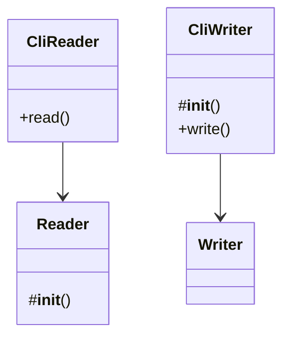

```mermaid
classDiagram
    CliReader --> Reader
    CliWriter --> Writer

    class Reader {
        #__init__()
    }

    class CliReader {
        +read()
    }

    class CliWriter {
        #__init__()
        +write()
    }
```
